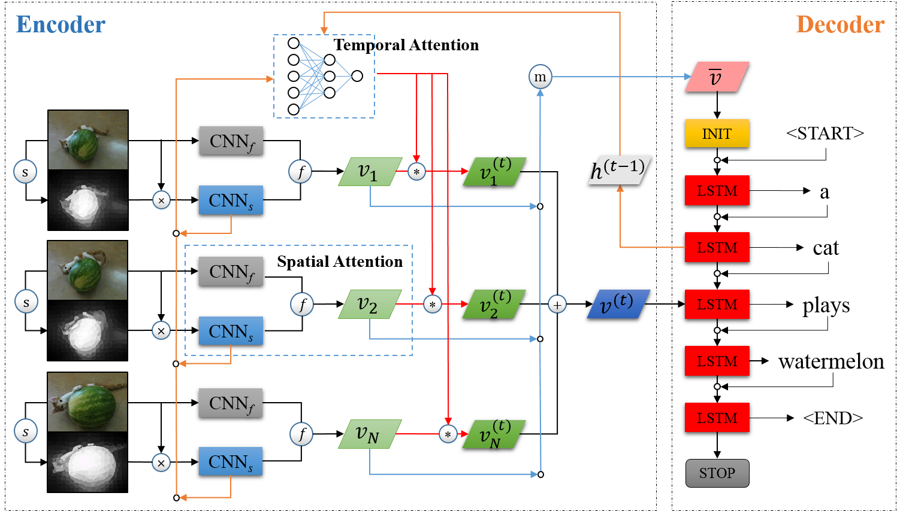
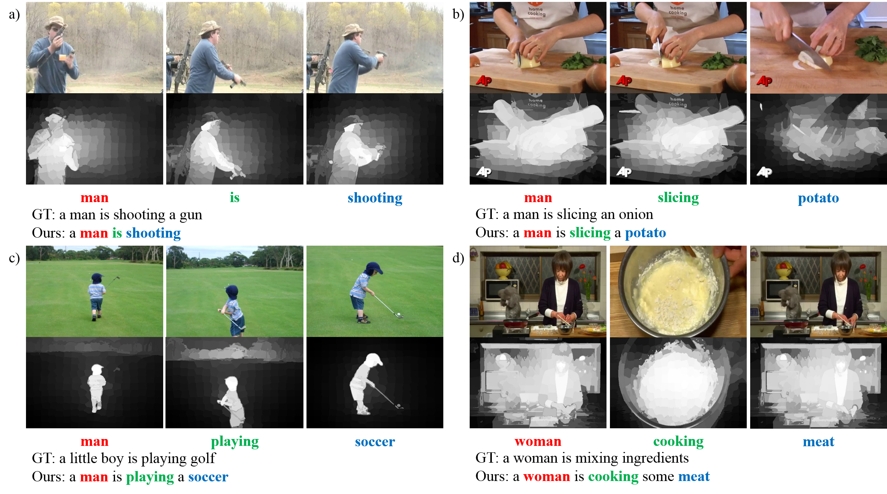

# Introduction
This is the repository for our paper: Saliency-based Spatio-Temporal Attention for Video Captioning.

Most existing video captioning methods ignore the visual saliency information in videos, which we argue that can be helped to generate more accurate video captions, so we proposed a saliency-based spatio-temporal attention mechanism and integrated it with the encoder-decoder framework of the classical video captioning model. Especially, we designed a residual block which can use the saliency information to properly extract the visual feature of video frames. We experimented our method on the MSVD dataset and the results showed that exploiting the visual saliency information can improve the performance of video captioning. Specifically, when compared with the traditional temporal attention method, our saliency-based temporal attention model can improve the METEOR and CIDEr metrics by 3.4% and 22.5% respectively. While used the full saliency-based spatio-temporal attention mechanism, we can further improve the METEOR and CIDEr by 4.5% and 23.1% respectively. The following diagram shows the framework of our model.

# Requirements
## Pretrained Model
- VGG16 pretrained on ImageNet [PyTorch version]: https://download.pytorch.org/models/vgg16-397923af.pth
## Datasets
- MSVD: https://www.microsoft.com/en-us/download/details.aspx?id=52422
- MSR-VTT: http://ms-multimedia-challenge.com/2017/dataset
## Packages
- torch
- torchvision
- numpy
- scikit-image
- nltk
- h5py
- pandas
- future  # python2 only
- tensorboard_logger  # for use tensorboard to view training loss

You can use:

        (sudo) pip2 install -r requirements.txt
        
to install all the above packages.
# Usage
## Preparing Data
Firstly, we should make soft links to the dataset folder and pretrained models. For example:

        mkdir datasets
        ln -s YOUR_MSVD_DATASET_PATH datasets/MSVD
        mkdir models
        ln -s YOUR_VGG16_MODEL_PATH models/
        
somes detail can be found in args.py.

Then we can:

1. Prepare video feature:

        python2 video.py
        
2. Prepare caption feature and dataset split:

        python2 caption.py
## Training
Before training the model, please make sure you can use GPU to accelerate computation in PyTorch. Some parameters, such as batch size and learning rate, can be found in args.py.
        
3. Train:

        python2 train.py
## Evaluating
        
4. Evaluate:

        python2 evaluate.py
        
5. Sample some examples:

        python2 sample.py
        
# Results
## Quantity
The following table gives a benchmark of video captioning methods on MSVD dataset. Our methods are STA(only use temporal attention), SSTA-S(use saliency region for spatial attention), SSTA-C(use both saliency region and full frame for spatial attention) and SSTA-R(use residual block to decide spatial attention).

| Model               |       B1 |       B2 |      B3 |       B4 |       M |       Cr |
| :------             | :------: | :------: | ------: | :------: | ------: | :------: |
| SA(GoogLeNet)       |        - |        - |       - |     40.3 |    29.0 |     48.1 |
| SA(GoogLeNet+C3D)   |        - |        - |       - |     41.9 |    29.6 |     51.7 |
| SV2T(VGG16)         |        - |        - |       - |        - |    29.2 |        - |
| S2VT(VGG16+OF)      |        - |        - |       - |        - |    29.8 |        - |
| LSTM-E(VGG19)       |     74.9 |     60.9 |    50.6 |     40.2 |    29.5 |        - |
| LSTM-E(VGG19+C3D)   |     78.8 |     66.0 |    55.4 |     45.3 |    31.0 |        - |
| p-RNN(VGG)          |     77.3 |     64.5 |    54.6 |     44.3 |    31.1 |     62.1 |
| p-RNN(VGG+C3D)      |     81.5 |     70.4 |    60.4 |     49.9 |    32.6 |     65.8 |
| HRNE(GoogLeNet)     |     79.2 |     66.3 |    55.1 |     43.8 |    33.1 |        - |
| HRNE(GoogLeNet+C3D) |     81.1 |     68.6 |    57.8 |     46.7 |    33.9 |        - |
| STA(VGG16)          |     75.5 |     61.4 |    50.6 |     40.2 |    30.0 |     58.9 |
| SSTA-S(VGG16)       |     73.1 |     58.3 |    47.7 |     37.1 |    28.9 |     54.0 |
| SSTA-C(VGG16)       |     75.7 |     61.5 |    50.4 |     39.8 |    30.1 |     57.9 |
| SSTA-R(VGG16)       |     82.1 |     66.9 |    56.0 |     45.3 |    30.3 |     59.2 |

## Quality
We select some good and bad examples to demonstrate the pros and cons of our method.
